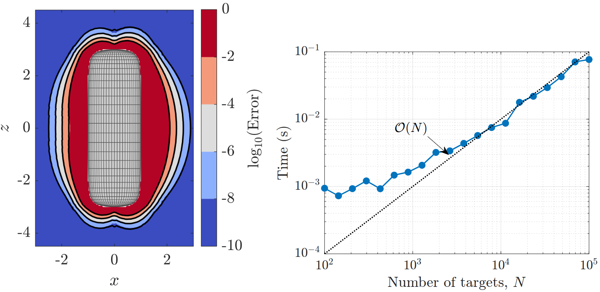

# QuadInd: Fast quadrature error indicators for layer potentials defined on axisymmetric geometries

**QuadInd** is a software package written in MATLAB for rapidly evaluating quadrature error indicators for layer potentials on axisymmetric surfaces. The indicators help determine whether a target can be handled by direct quadrature or uniform upsampling, or instead requires a special quadrature method.

The figure below shows QuadInd applied to the Stokes double layer potential on a capsule-shaped particle. The predicted error contours in black closely follow the measured quadrature error shown in color (left), while evaluating the indicators is inexpensive and scales linearly with the number of targets (right).



## Scope and limitations

QuadInd currently constructs indicators only for `quadind.kernel.StokesStresslet`.

The indicator construction assumes that:

- The source surface is closed and axisymmetric, and the target points lie in its exterior.
- The surface is discretized using a tensor-product quadrature rule with Gauss–Legendre nodes in the meridional direction and equispaced trapezoidal nodes in the periodic azimuthal direction. The density must be sampled on this grid.
- The geometry is symmetric about `z = 0`. QuadInd tabulates only the `z >= 0` meridional half-plane and maps targets using `abs(z)`; asymmetric geometries are rejected during evaluator construction.
- The base quadrature grid sufficiently resolves both the surface geometry and the density. New shapes, aspect ratios, highly oscillatory densities, and tolerance ranges should be validated before use.

## Quick start

```matlab
% 1. Define an axisymmetric geometry
geometry = quadind.geometry.Spheroid('a', 0.05, 'c', 0.1);

% 2. Select the kernel
kernel = quadind.kernel.StokesStresslet();

% 3. Precompute the indicator tables
evaluator = quadind.IndicatorEvaluator(geometry, kernel, ...
    'nth', 40, 'nph', 60, 'upsampFactors', 1:2);

% 4. Define a density and target points
grid = evaluator.getGrid();
density = ones(grid.numPoints(), kernel.numComponents());
targets = [0.10, 0, 0; 0.052, 0, 0];

% 5. Evaluate base-grid indicators and classify the targets
[indicators, classification] = evaluator.evaluate( ...
    targets, density, 'tol', 1e-6);
```

For each target, the classification contains:

- `upsamplingFactor`: the smallest tabulated factor whose indicator falls below the requested tolerance;
- `requiresSpecialQuadrature`: true if none of the tabulated factors is sufficient;
- `indicators`: indicator values evaluated up to the first accepted factor
  (`NaN` at later, unevaluated factors);
- `masks`: logical masks identifying the targets first accepted at each factor;
- `tol`: the requested tolerance.

## Examples

Run the examples from the repository root:

```matlab
run('examples/demo_minimal.m');
run('examples/demo_nearfield.m');
run('examples/demo_validation.m');
```

Scripts in `examples-paper/` generate the figures used in the associated paper.

## Tests

```matlab
% Run all unit tests
results = run_tests();

% Run one test class
addpath('tests');
suite = matlab.unittest.TestSuite.fromClass(?TestIndicatorEvaluation);
results = run(suite);
```

## Authors

- **David Krantz** (KTH Royal Institute of Technology)
- **Pritpal “Pip” Matharu** (Max Planck Institute for Mathematics in the Sciences)

The legacy implementation is archived for reference; see [legacy/README.md](legacy/README.md).

## References

If you find this code useful in your research, please cite the following works:

* Our paper. TODO.
* L. af Klinteberg, C. Sorgentone, and A.-K. Tornberg, *Quadrature error estimates for layer potentials evaluated near curved surfaces in three dimensions*, Computers & Mathematics with Applications, 111 (2022), pp. 1–19, https://doi.org/10.1016/j.camwa.2022.02.001.
* C. Sorgentone and A.-K. Tornberg, *Estimation of quadrature errors for layer potentials evaluated near surfaces with spherical topology*, Advances in Computational Mathematics, 49 (2023), article 87, https://doi.org/10.1007/s10444-023-10083-7.

The software itself is also archived on Zenodo and can be cited as:

* TODO
